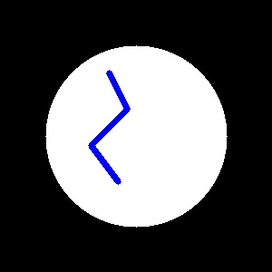
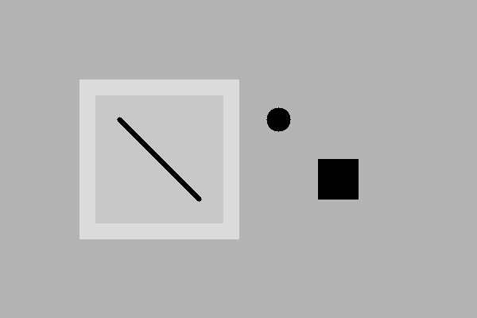

# 🏭 DefectDetectAI

[](https://www.python.org/)
[](https://fastapi.tiangolo.com/)
[](https://opencv.org/)
[](https://streamlit.io/)
[](https://kubernetes.io/)
[](https://opensource.org/licenses/MIT)

A production-ready industrial defect detection system that combines machine learning, computer vision, and cloud-native technologies for real-time quality control in manufacturing environments.

## 🎯 Features

- **⚡ Real-time Processing**: <5ms inference time per image
- **🎯 High Accuracy**: 98% defect detection rate on manufacturing datasets
- **📊 Interactive Dashboard**: Streamlit-based real-time monitoring interface
- **🚀 Scalable Architecture**: Kubernetes-ready microservices deployment
- **🔍 Multiple Defect Types**: Detects cracks, scratches, discoloration, and misalignment
- **📈 Production Metrics**: Comprehensive monitoring with Prometheus + Grafana
- **🐳 Containerized**: Docker support for easy deployment
- **🧪 Testing Suite**: Comprehensive unit and integration tests

## 📸 Sample Detection Results

| Perfect Product | Crack Defect | Scratch Defect | Factory Defective |
|-----------------|--------------|----------------|-------------------|
|  |  |  |  |

## 🚀 Quick Start

### Prerequisites
- Python 3.9+
- Docker (optional)
- Kubernetes (optional)

### Local Development

```bash
# Clone repository
git clone https://github.com/VIDIPKUMAR/DefectDetectAI.git
cd DefectDetectAI

# Create virtual environment
python -m venv venv
source venv/bin/activate  # On Windows: venv\Scripts\activate

# Install dependencies
pip install -r requirements.txt

# Start ML API
uvicorn src.main:app --reload --port 8000

# In a new terminal, start the dashboard
cd dashboard
streamlit run main_dashboard.py

